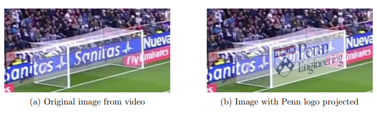

# Homography-transformation-of-images
Projection of a desired image onto a reference image using homography transformation.

### Objectives ###
Project a logo onto video frames of a goalpost in a football match in a natural way that respects perspective using the concepts of projective geometry and homographies.  

### How to use ###
^ Clone the repository.
* Extract the **barcaRealimgs** zip file in place ``images/barcaReal/``.
* Run the **project_logo.m** file.
* Run the command ``play_video(projected_imgs)`` to visualize the result.
